# Overview

Full Pipelines from Source over MEdallion Architecture until Reporting Layer.

We will address those steps:

- Creating dummy data we will use as source
- Loading those source data into Azure Synapse bronze layer and moving over silver to gold
- Visualizue data from gold Layer in PowerBI
- Show basic data governence by adding RLS to PowerBI

Those steps are described below.

## Create dummy data

## Medallion in Azure Synapse

## Visualization in PowerBI

## Setup RLS

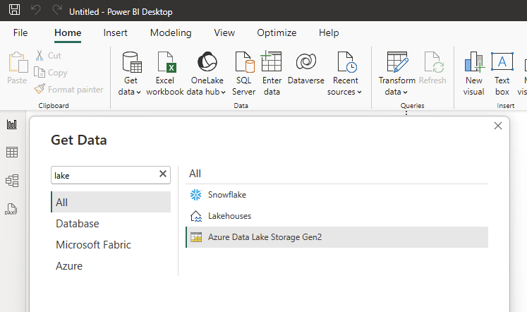

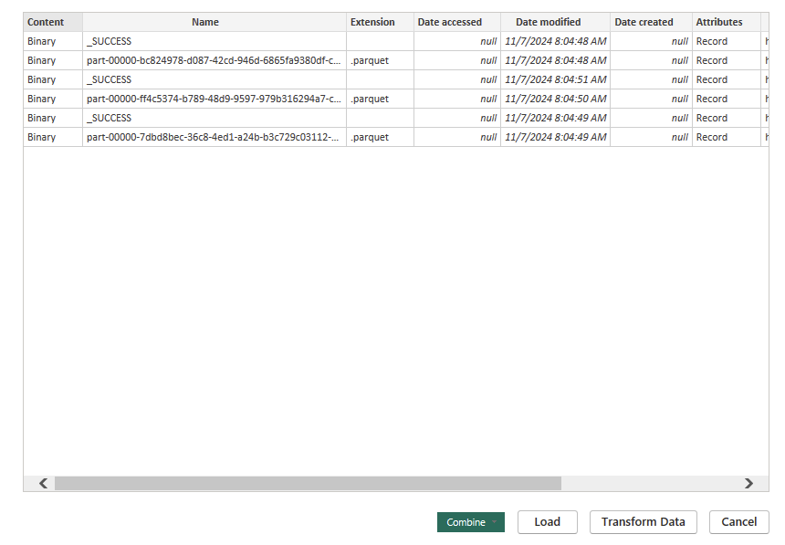

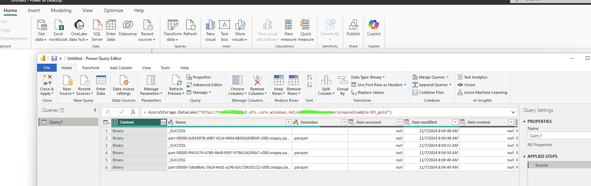

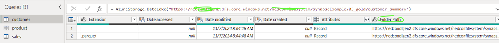

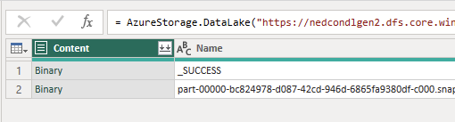

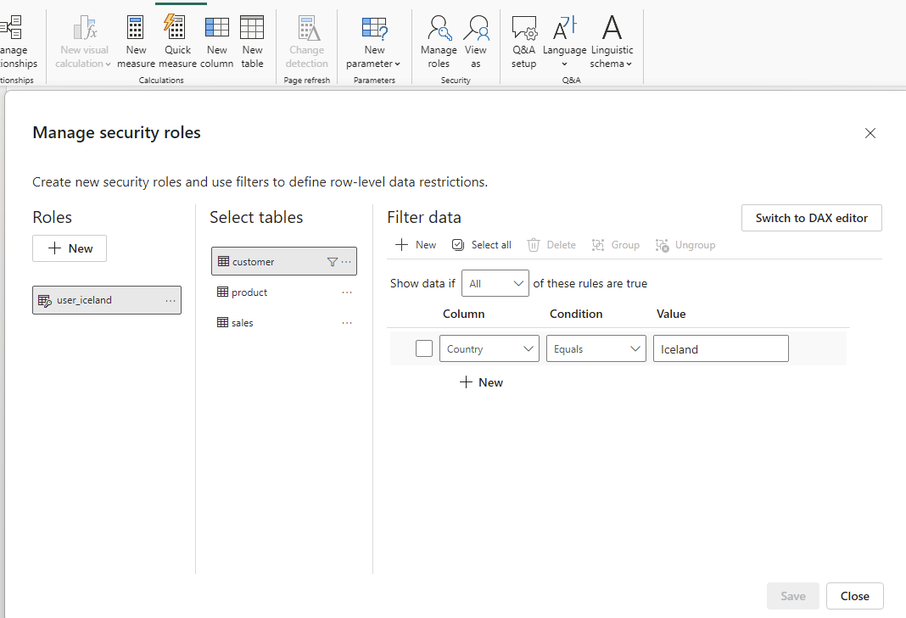

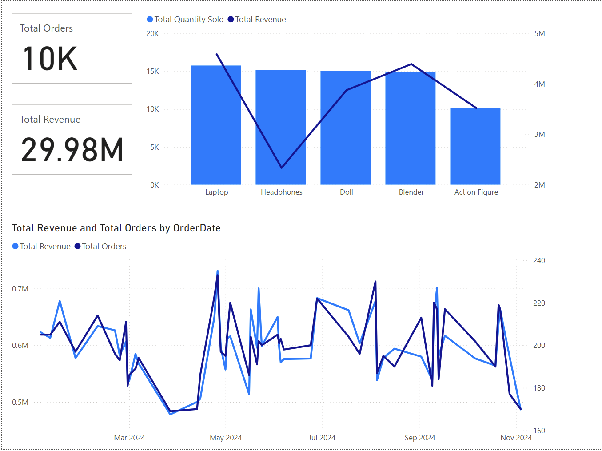

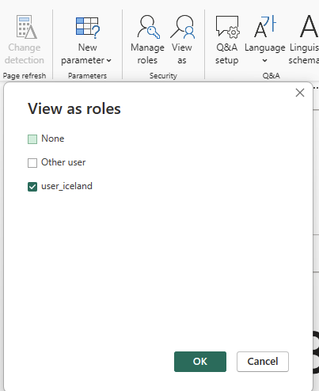

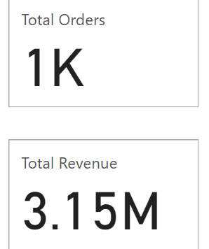

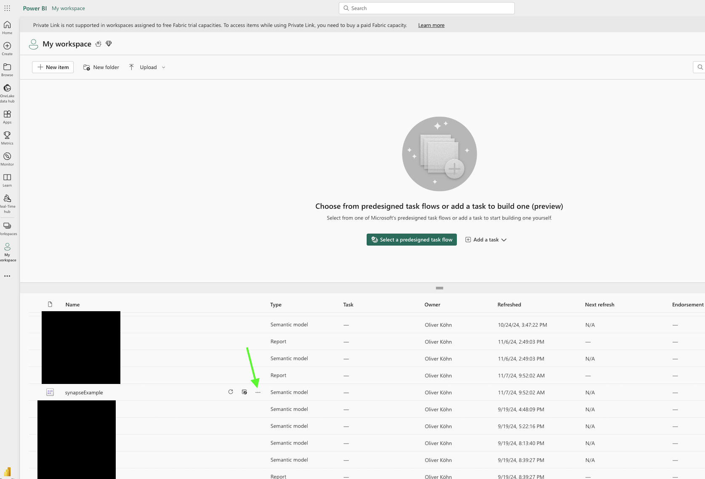

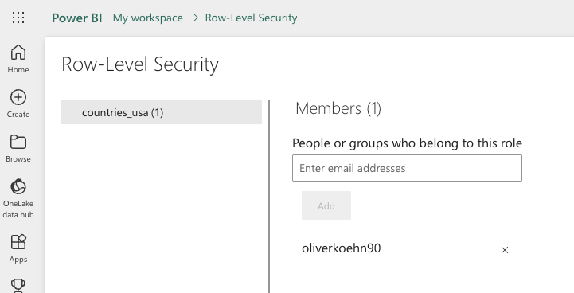